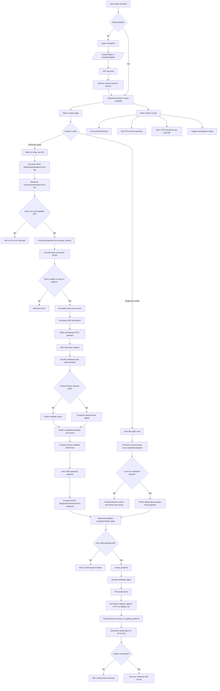

# OTTO Bot Workflow Flowchart

This flowchart is derived from the current codebase workflow for authentication and product creation.

## Source references

- Frontend creator flows: `frontend/app/creator/page.tsx`
- Auth token + session cookie handling: `frontend/lib/auth.ts`
- Auth endpoints: `app/api/routes/auth.py`
- Product creation endpoints: `app/api/routes/products.py`
- Upload normalization pipeline: `app/services/product_creation_service.py`
- OTTO client service boundary: `app/services/product_service.py`

## Notes

- The main creation workflow has two entry points in the UI:
  - file-based prepare -> review/edit -> create
  - manual single-row entry -> create
- Both paths converge on `/v1/products/create-from-prepared`.
- Product routes are protected by `get_current_user` and employee-role checks.
- Error handling is stage-aware and reports `normalize`, `validate`, and `create` issues.
